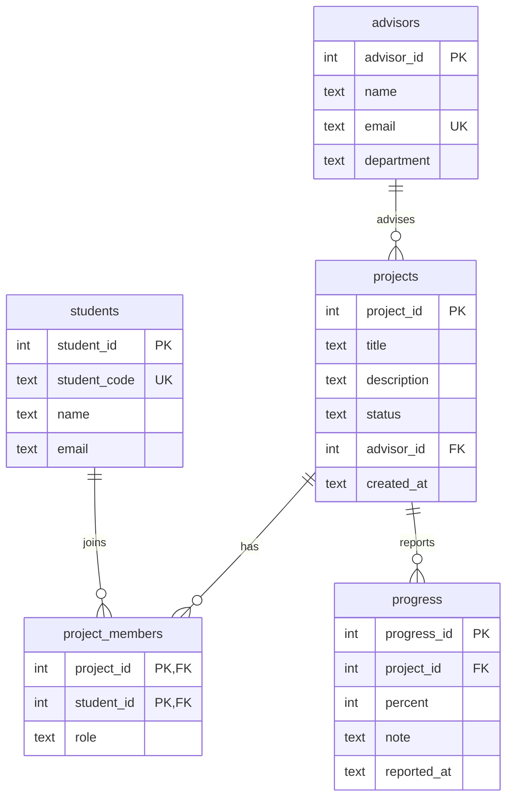

# ระบบจัดการโครงงานนักศึกษา (Student Project Management)

Flask + SQLite · REST API · Frontend (HTML/JS) — Mini Project ออกแบบ Database, REST API, JSON และทดสอบ API

## วิธีติดตั้งและใช้งาน
```bash
git clone <URL-ของ-repository>
cd student-project-system
python -m venv venv && source venv/bin/activate   # Windows: venv\Scripts\activate
pip install -r requirements.txt
python app.py            # เปิด http://localhost:5000
python test_api.py       # รันชุดทดสอบ API
```
ครั้งแรกระบบสร้าง `project.db` จาก `schema.sql` พร้อมข้อมูลทดลองให้อัตโนมัติ (ลบไฟล์ `project.db` เพื่อรีเซ็ต)

## 1) ER Diagram

**Relationships:** Advisor 1–N Project · Project N–M Student (ผ่าน `project_members`) · Project 1–N Progress

## 2) Database Table
| ตาราง | Field (Type) | PK / FK |
|---|---|---|
| advisors | advisor_id INTEGER, name TEXT, email TEXT UNIQUE, department TEXT | PK advisor_id |
| students | student_id INTEGER, student_code TEXT UNIQUE, name TEXT, email TEXT | PK student_id |
| projects | project_id INTEGER, title TEXT, description TEXT, status TEXT (planning/development/testing/completed), advisor_id INTEGER, created_at TEXT | PK project_id · FK advisor_id → advisors |
| project_members | project_id INTEGER, student_id INTEGER, role TEXT | PK (project_id, student_id) · FK → projects, students |
| progress | progress_id INTEGER, project_id INTEGER, percent INTEGER (0-100), note TEXT, reported_at TEXT | PK progress_id · FK project_id → projects |

## 3) API Endpoint List
| Function | Method | Endpoint | Status |
|---|---|---|---|
| ดูโครงงานทั้งหมด (กรอง `?status=`) | GET | /api/projects | 200 |
| ดูโครงงานรายการ (พร้อมสมาชิก+ความก้าวหน้า) | GET | /api/projects/{id} | 200, 404 |
| เพิ่มโครงงาน | POST | /api/projects | 201, 422 |
| แก้ไขโครงงานทั้งชุด | PUT | /api/projects/{id} | 200, 404, 422 |
| แก้ไขบางส่วน | PATCH | /api/projects/{id} | 200, 404, 422 |
| ลบโครงงาน | DELETE | /api/projects/{id} | 200, 404 |
| ดูความก้าวหน้า | GET | /api/projects/{id}/progress | 200 |
| รายงานความก้าวหน้า | POST | /api/projects/{id}/progress | 201, 422 |
| เพิ่มสมาชิกโครงงาน | POST | /api/projects/{id}/members | 201, 422, 409 |
| ลบสมาชิกออกจากโครงงาน | DELETE | /api/projects/{id}/members/{student_id} | 200, 404 |
| ดู / เพิ่มนักศึกษา | GET / POST | /api/students | 200 / 201 |
| ดูอาจารย์ที่ปรึกษา | GET | /api/advisors | 200 |

## 4) JSON ตัวอย่าง
**GET /api/projects** → 200
```json
{
  "success": true,
  "count": 1,
  "data": [{
    "id": 1, "title": "ระบบจัดการโครงงาน", "description": "เว็บระบบติดตามโครงงานนักศึกษา",
    "status": "development", "created_at": "2026-10-01 08:00:00",
    "advisor_id": 1, "advisor_name": "ผศ.ดร.สมชาย ใจดี",
    "member_count": 2, "latest_percent": 60
  }]
}
```
**POST /api/projects** — Request
```json
{ "title": "แอปจองห้องประชุม", "description": "ระบบจองห้อง", "status": "planning", "advisor_id": 2 }
```
Response 201: `{ "success": true, "data": { "id": 3 } }`

**Error** 422: `{ "success": false, "error": { "message": "title ต้องเป็นข้อความ 1-200 ตัวอักษร" } }`

## 5) ผลทดสอบ API (`python test_api.py`)
| Test | Method | Expected | Actual | Status |
|---|---|---|---|---|
| 1 | GET /api/projects | 200 แสดงข้อมูล | 200 | PASS |
| 2 | POST /api/projects | 201 เพิ่มข้อมูล | 201 | PASS |
| 3 | PUT /api/projects/3 | 200 แก้ไขข้อมูล | 200 | PASS |
| 4 | DELETE /api/projects/3 | 200 ลบข้อมูล | 200 | PASS |
| 5 | Invalid Request (ไม่มี title) | 422 แสดง Error | 422 | PASS |
| 6 | GET /api/projects/999 | 404 | 404 | PASS |
| 7 | SQL Injection ใน title | 201 (เก็บเป็นข้อความ ตารางไม่เสียหาย) | 201 | PASS |

> **ที่ต้องทำเอง:** แคปหน้าจอทดสอบ API (Postman / Thunder Client / curl) และหน้าเว็บที่ดึงข้อมูลจาก DB สำเร็จ แล้วใส่ในโฟลเดอร์ `screenshots/`

## ความปลอดภัย
- ใช้ Parameterized Query ทุกจุด (ชื่อคอลัมน์ใน UPDATE มาจาก whitelist)
- ตรวจสอบ Input (ชนิด, ความยาว, ช่วงค่า, FK ต้องมีอยู่จริง)
- Frontend ใช้ `textContent` ป้องกัน XSS · ไม่มี Password/API Key ใน repo (`.gitignore` ตัด `.env`, `*.db`)
